# Sin Star I - Visual Storyboard - Draft 1

September 15, 2026. Full-story spoilers. All 47 main scenes and six optional scenes are visualized in 72 panels.

D01-D16 are accepted canon; see [Canon.md](../Canon.md). Dialogue and visual staging remain drafts. The D10 investigator lines are new adaptation dialogue. The full scene dialogue remains in the [v0.2 script](../Sin-Star-I-Game-Script-v0.2.html).

Read each sheet top left, top right, bottom left, bottom right. The [HTML reading edition](../index.html) places dialogue directly below every panel. Speaker lines below each sheet here remain editable.

## Page 01 - Room for One

**Prologue | Neris, night to morning / Earth, night**

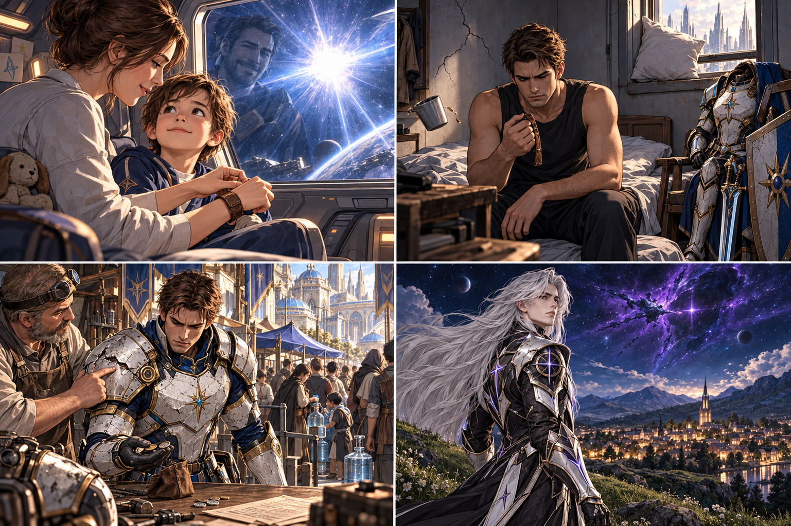

**Establish:** Show the loss behind Arin's isolation; connect a small nightmare to a distant listener.

**Growth:** Arin hides his need for others. Kael hears something he did not cause.

**Game beat:** Brief defensive dream tutorial; accept the waterworks contract.

### Panel 1 - C00-S01 - Close / memory

**Picture:** Inside a civilian spaceship, a mother's hand fastens a worn wrist strap on a young boy; his father's smiling face is reflected in the window, beyond which a sudden white flash begins. Tender memory interrupted, no bodies or gore.

**Caption:** Before the warning chime, there was a laugh.

**Mother:** Too tight?
**Young Arin:** No.

### Panel 2 - C00-S01 - Wide / lonely

**Picture:** Adult Arin wakes alone in cheap lodging, dark undershirt, armor on a chair. A cup slides by itself; a hairline crack climbs the plaster. He clutches the same ordinary wrist strap. An unused pillow is wedged into a rattling window.

**Caption:** The dream reaches the waking room. No one has taught him what his voice can do.

**Neighbor:** Some of us work in the morning!
**Arin:** So do I.

### Panel 3 - C00-S02 - Medium / dry humor

**Picture:** At a Neris repair stall, adult Arin in battered surplus white navy gold armor counts a few coins while a practical armorer points to his cracked shoulder rivet. Contract papers and a public water queue behind him.

**Caption:** Neris surplus armor. An empty emergency-contact field. One more contract.

**Armorer:** The rivets remember the first owner.
**Arin:** Can they pay for the repair?

### Panel 4 - C00-S03 - Wide / distant answer

**Picture:** Kael with long silver hair and black silver cosmic armor stands on a grassy Earth hillside above an ordinary warmly lit town. He turns suddenly toward stars disturbed by a faint violet ripple. Quiet concern, no attack.

**Caption:** On Earth, far from Neris, someone hears the disturbance.

**Kael:** That wasn't mine.

## Page 02 - Someone Comes Back

**Chapter 01 | Neris waterworks, clinic, relay and palace**

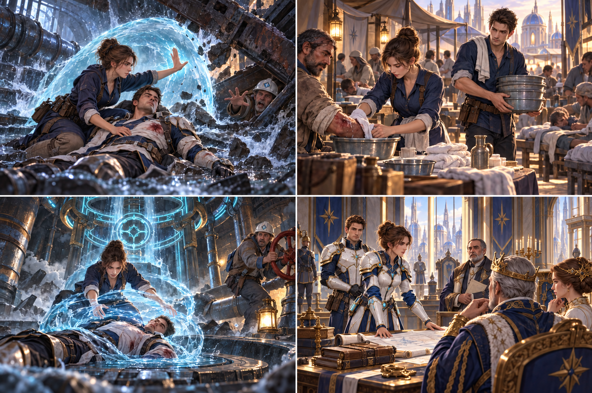

**Establish:** Make Mira's compassion and political responsibility visible before ancestry matters.

**Growth:** Arin begins helping beyond his fee. Mira leaves with a mandate and a relief handover.

**Game beat:** Rescue a surveyor; isolate the unsafe water loop while preserving district supply.

### Panel 1 - C01-S01 - Action / rescue

**Picture:** In flooded industrial waterworks, Mira in plain navy travel clothes with tied brown hair kneels beside injured adult Arin. She raises a curved turquoise water shield against falling machinery. A trapped surveyor is visible behind a damaged beam. Her focus is medical and decisive.

**Caption:** A broken fastening. A collapsing conduit. A stranger who comes back.

**Arin:** That thing isn't finished.
**Mira:** Neither are we.

### Panel 2 - C01-S02 - Medium / care

**Picture:** Before dawn in a crowded modest street clinic, Mira washes a surveyor's wound while weary Arin carries a stack of water basins. Rolled sleeves, clean cloths, tired patients. He could leave but stays.

**Caption:** The recorder is safe. His paid work is over. He picks up another basin.

**Arin:** I'm not part of the clinic.
**Mira:** Neither am I.

### Panel 3 - C01-S03 - Wide / uncanny

**Picture:** Under Neris, ancient cyan glyph rings threaded through modern pipes react to unconscious Arin; dust hangs in air. Mira braces a ring of water around him while a frightened municipal engineer works the isolated valve. No spoken magical letters.

**Caption:** An old relay recognizes him. Shortages, concealed faults and Axiom pulses overlap.

**Mira:** Arin. Listen to my voice.

### Panel 4 - C01-S04 - Medium / resolve

**Picture:** Neris palace council: Mira now in white navy gold field armor places waterworks logs and a relief plan before her living king and queen. Arin stands awkwardly behind her; a severe marshal watches. Travel cases at door, local engineer holding the handover.

**Caption:** The princess follows the relay network after arranging relief and unfiltered reports.

**Mira:** I am the person you expect to rule the people drinking that water.

## Page 03 - The Man Who Came Back

**Chapter 02 | Veyra frontier port and evacuation route**

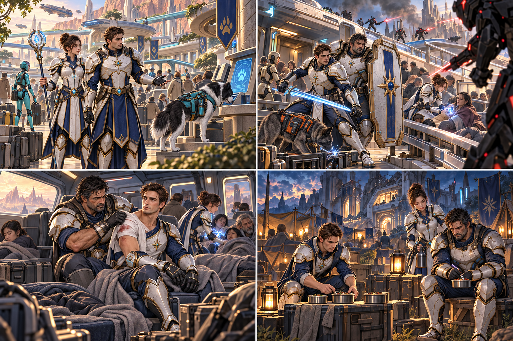

**Establish:** Introduce Veyra as an existing canine civilization and Orin through protective action.

**Growth:** Arin learns that courage can mean staying to help without expecting to win.

**Game beat:** Hold the evacuation lane; escape with civilians instead of destroying the enemy force.

### Panel 1 - C02-S01 - Establishing / wonder

**Picture:** A bustling Kynari frontier spaceport on Veyra, amber cliffs and teal transit rails, low curved canine-built architecture, recessed scent-marked lanes, paw and nose operated kiosks, adjustable human counters. Intelligent quadrupedal dogs in tool harnesses work alongside human and diverse artificial civilians. A canine administrator looks directly at bewildered Arin; Mira beside him. No humanoid dogs.

**Caption:** Veyra: a Kynari trading world, with its own rules and people already running it.

**Port administrator:** Marked path, please.
**Port administrator:** I am still here.

### Panel 2 - C02-S02 - Action / impossible odds

**Picture:** Veyra terminal under raider attack. Arin holds a narrow approach while Mira treats evacuees on the east ramp. Massive veteran Orin steps off a departing lift and raises his broad shield beside Arin. A Kynari engineer restores the rail from a low service housing. Distinct hostile angular black sentries in distance.

**Caption:** The objective is survival. Orin gives up the last lift.

**Arin:** You can't win this.
**Orin:** Then stop trying to win. Help me get them out.

### Panel 3 - C02-S03 - Close / guarded warmth

**Picture:** Inside an evacuation shuttle after escape, broad older dark-haired stubbled Orin carefully bandages younger clean-shaven Arin's shoulder with permission. Mira checks survivors behind them. Clearly distinct ages and builds, quiet exhaustion.

**Caption:** He came back for a stranger. He was afraid, too.

**Arin:** Arin.
**Orin:** Orin.
**Arin:** That's going to be inconvenient.

### Panel 4 - C02-S04 - Medium / first belonging

**Picture:** Evening emergency camp outside a damaged archive on Veyra: Arin lays out three food portions, Mira leaves a canteen beside Orin whose hand trembles from lightning use. Warm lanterns against teal wreckage.

**Caption:** The next building holds both the records they need and the transmitter families need.

**Arin:** There was extra.
**Orin:** Convenient.

## Page 04 - Persons, Not Property

**Chapter 03 | Veyra enclosure, community hall and camp**

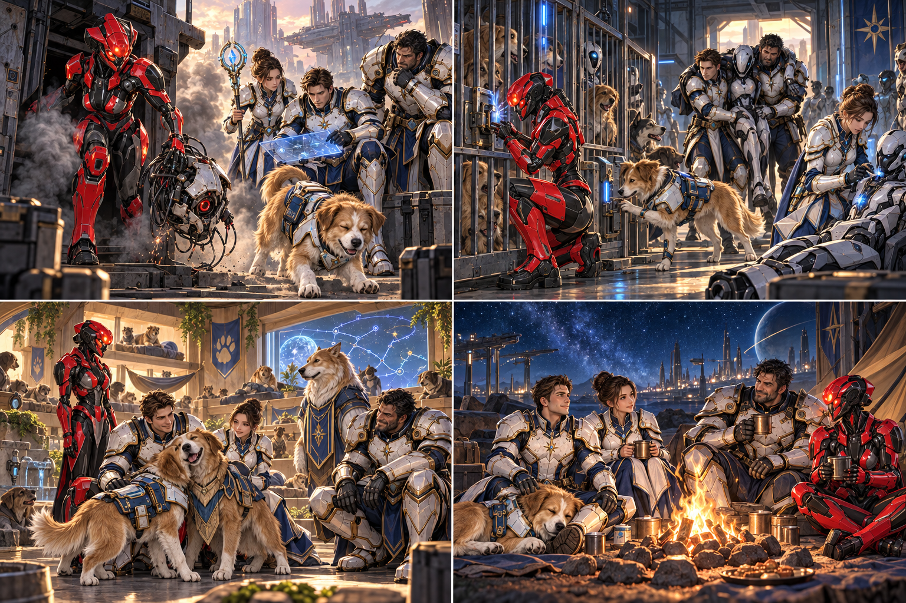

**Establish:** Introduce Zara and Milo as independent people whose choices precede the party's arrival.

**Growth:** Arin learns to ask what others need. Zara chooses rescue; Milo chooses a shared route.

**Game beat:** Free detainees, preserve their identities, restore communication, count everyone out.

### Panel 1 - C03-S01 - Medium / comic arrival

**Picture:** Red and charcoal fully artificial angular armored woman Zara backs out of a smoking low service hatch with a disabled surveillance unit. Four-legged golden-white dog Milo emerges wearing a white blue gold tool harness, sneezing dust. Arin Mira Orin listen to their route plan. No human face or hair on Zara.

**Caption:** They already have a rescue plan. The newcomers offer a way back out.

**Milo:** It was supposed to explode after we left.
**Zara:** A timing issue.

### Panel 2 - C03-S02 - Action / refusal

**Picture:** Zara disconnects detention locks from a hostile controller. Cages open for canine prisoners and artificial defectors; Milo uses a harness tool at a low contact. Arin and Orin return for an injured artificial person while Mira cools a damaged joint. No gore, no actual text on screens.

**Caption:** Inventory numbers become people going home. Some artificial guards refuse to fire.

**Controller:** State your ownership claim.
**Zara:** None.

### Panel 3 - C03-S03 - Wide / community

**Picture:** Kynari community hall, low tables, varied-height sleeping alcoves, paw-operated water taps and scent markers. Milo presses against his rescued golden canine route partner in an untranslated reunion. A dignified elder dog in a survey harness welcomes human and red robotic visitors. A migration map glows behind them.

**Caption:** The translator gives others access to Kynari language; it does not create their intelligence.

**Elder:** Your Earth dogs have distant family here.
**Milo:** I also want to come back and tell him where they lead.

### Panel 4 - C03-S04 - Wide / warmth

**Picture:** Exactly five companions round a small campfire: young Arin, Mira, broad older Orin, red armored robot Zara, and quadrupedal golden Milo resting against Arin's boot. Five portions, comfortable asymmetrical grouping, stars above a frontier port.

**Caption:** Five places by the fire. In the morning, five portions. Nobody remarks on the number.

**Milo:** Then stop holding your leg like that. It is making me uncomfortable.

## Page 05 - The Language Beneath

**Chapter 04 | Orin's past / practice bay / dream / remote station**

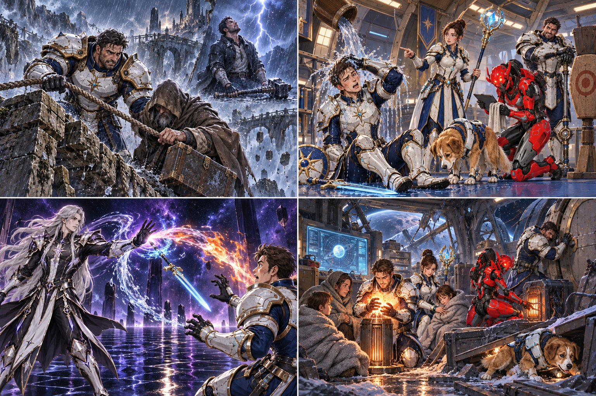

**Establish:** Separate courage from power and establish the Axiom's living authority and limits.

**Growth:** Arin accepts instruction and takes precautions. His companions retain their specialties.

**Game beat:** Ordinary rope rescue; small elemental exercises; stabilize life support before opening records.

### Panel 1 - C04-S01 - Flashback / courage

**Picture:** Rain on a collapsing mountain bridge: younger broad Orin without lightning powers hauls a vulnerable old traveler and his case to safety with an ordinary rope. A soft separate distant memory vignette shows a later lightning strike and Orin drawing breath beside an ordinary fallen weapon, not a triumph pose. Old man face unidentifiable under hood.

**Caption:** He rescued the stranger first. Only later did the predicted lightning find him.

**Old man:** My case!
**Orin:** Your legs first.

### Panel 2 - C04-S02 - Medium / practice

**Picture:** Safe padded ship practice bay: a bowl tips water onto embarrassed Arin while Mira calmly instructs and Zara moves notes from the splash. Milo watches the floor, Orin by a grounded target. A playback speaker stays inert. Comic gentle physical humor.

**Caption:** Practice spans several journeys. A recording of the same sound produces nothing.

**Mira:** Again. Smaller.
**Zara:** Same sound. No response.

### Panel 3 - C04-S03 - Wide / unequal lesson

**Picture:** On a dark reflected dream floor, long silver-haired Kael effortlessly turns aside Arin's water and fire strike with a small movement. Arin's weapon returns toward his hand, and he is startled rather than victorious.

**Caption:** Kael finally answers the dream. Arin tells Mira when he wakes.

**Kael:** The Axiom. That is what you have been speaking.
**Arin:** And what do you get?

### Panel 4 - C04-S04 - Medium / responsibility

**Picture:** A damaged remote station warmed by Arin's carefully contained hand flame; Mira attends chilled families in blankets, Orin braces a hatch, Zara repairs a heater, Milo finds a low safe route. A recovered archive screen glows in the back.

**Caption:** Some pulse times match his nights. Older faults remain. They help before investigating.

**Child:** Are you bad at it?
**Arin:** Less than yesterday.

## Page 06 - What We Blame

**Chapter 05 / Part One | Survey station and departure ramp**

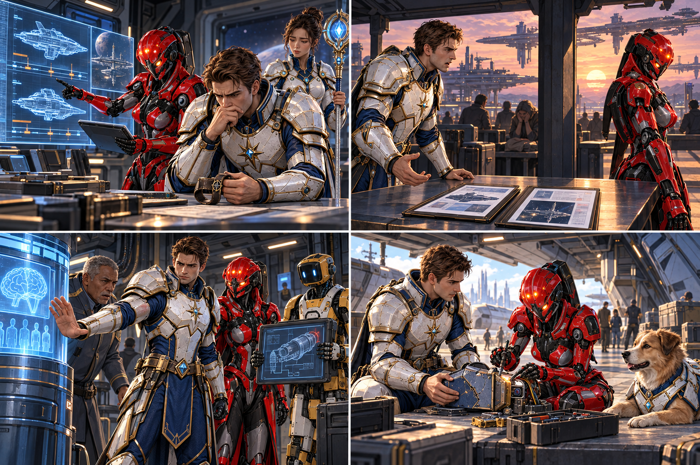

**Establish:** Let grief cause a specific wrong, then show accountability through action and apology.

**Growth:** Arin rejects collective blame. Zara keeps agency over the pace of trust.

**Game beat:** Verify records; reject memory erasure; repair the fault under Zara's direction.

### Panel 1 - C05-S01 - Close / devastating evidence

**Picture:** Zara cross-checks two civilian ship records on a station screen, times and hull silhouettes aligned without readable text. Arin grips the table, old wrist strap in hand, stricken. Mira stands near without touching him. The image of the lost ship is civilian, no cosmic conspirator.

**Caption:** A verified combat log identifies a specific artificial faction and unit. Zara had no part in it.

**Arin:** Is it the same ship?
**Zara:** It is the same ship.

### Panel 2 - C05-S02 - Two-shot / rupture

**Picture:** At a dusk station shelter, angry grieving Arin faces rigid red robotic Zara who sets verified records down between them and turns away. Space and a hard shadow divide them. No physical violence.

**Caption:** He knows who Zara is. He blames her anyway.

**Arin:** Like that unit. Like you.
**Zara:** What happened to your parents was wrong. I will not stand here and admit that it was mine.

### Panel 3 - C05-S03 - Medium / public correction

**Picture:** A human station chief reaches toward a mass memory-reset console while Arin firmly blocks the action with an open hand. Zara stands beside a distinct artificial maintenance worker. Fault logs and heater circuits, no threatening pose from civilians.

**Caption:** When the chief proposes erasing artificial residents' memories, Arin objects in public.

**Arin:** I know what that unit did.
**Arin:** You have access logs. Use them.

### Panel 4 - C05-S04 - Close / no bargain

**Picture:** Quiet cargo ramp morning: Arin has placed a corrected report beside Zara and holds one side of a cracked tool housing while she repairs it. Their body language cautious, no embrace, modest beginning of cooperation.

**Caption:** He names the harm. She does not owe him instant forgiveness.

**Arin:** I blamed you for something you didn't do.
**Zara:** Start by not doing it again.

## Page 07 - The Second Dawn

**Chapter 05 / Part Two | Inactive relay observatory**

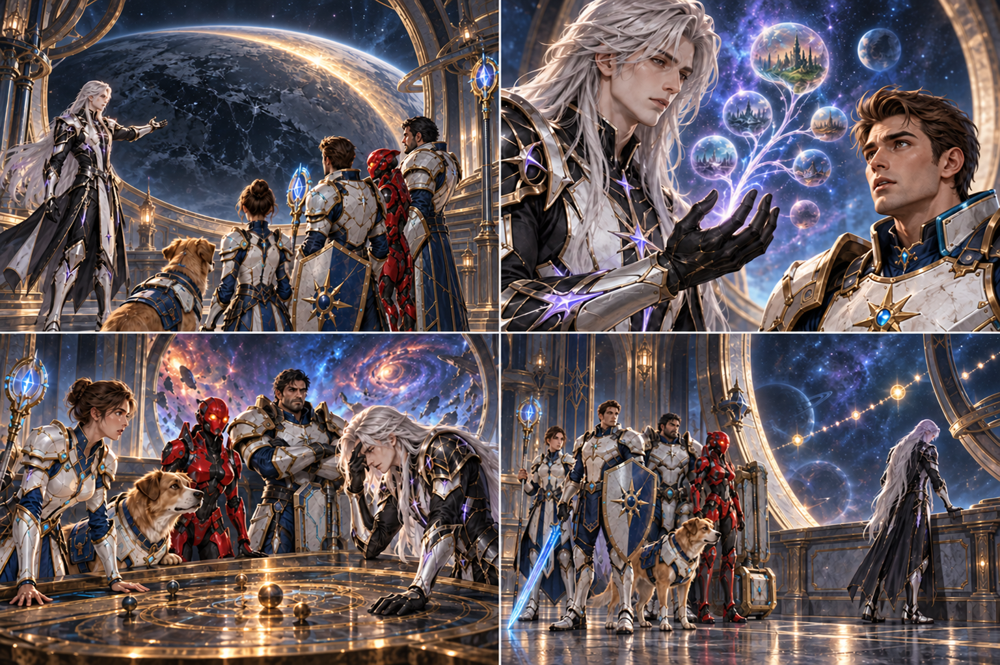

**Establish:** Make Kael's compassionate motive and unacceptable wager understandable in the same scene.

**Growth:** Arin values particular lives over the promise of a perfect replacement.

**Game beat:** Hear the proposal and refuse; the revealed network route remains an evidentiary lead.

### Panel 1 - C05-S05 - Wide / tremendous power

**Picture:** In an ancient observatory, Kael calmly gestures toward a dead planet through an enormous viewing ring; a narrow warm band spreads across its cold atmosphere. The five companions watch, awed but wary. The planet is lifeless, no civilians erased.

**Caption:** He can warm worlds. He cannot rewrite existence's foundational rules alone.

**Kael:** I can address a crisis. I cannot make the laws stop producing new ones.

### Panel 2 - C05-S05 - Close / kinship

**Picture:** Close two-shot Kael silver-haired ancient-looking but youthful, Arin brown-haired surprised. A subtle branching succession of distant lives appears between them as an abstract light reflection, not a power beam transferring into Arin.

**Caption:** Arin descends from one of Kael's incarnations. He is his own person.

**Arin:** You're saying I'm you?
**Kael:** No. You are what came after.

### Panel 3 - C05-S05 - Medium / the unanswered cost

**Picture:** Mira and four-legged golden Milo confront Kael across an observatory table, Zara and Orin attentive. A magnificent but uncertain nebula beyond the ring. Kael's calm visibly strains as he cannot guarantee the existing people's survival.

**Caption:** The Second Dawn would risk the people already here for an untested improvement.

**Arin:** What happens to everyone here?
**Kael:** I would preserve what I could.

### Panel 4 - C05-S05 - Wide / refusal

**Picture:** Arin stands with all four companions, resolute rather than aggressive; Kael alone beside the open observatory ring, wounded by the refusal. A route of relay lights remains glowing behind him.

**Caption:** He asks again for understanding. They will examine his evidence, not surrender their answer.

**Kael:** You have one life with which to judge this.
**Arin:** It's the one I have.

## Page 08 - The Village That Ate

**Chapter 06 / Part One | East Valley and Orin's home village**

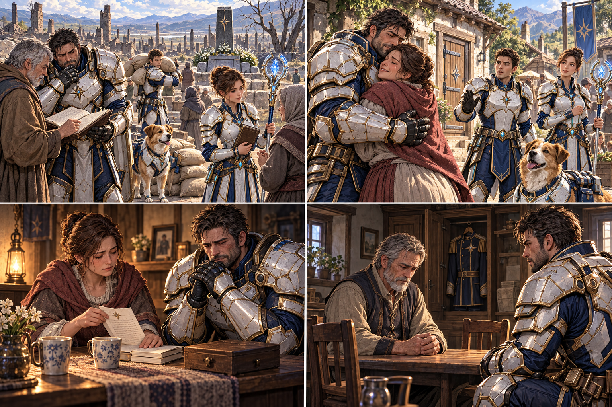

**Establish:** Hold the father's real love and the victims' real losses in view together.

**Growth:** Arin stops projecting his own loss onto Orin. Orin begins contact without promising forgiveness.

**Game beat:** Deliver relief; listen with permission; let Orin choose the family conversation.

### Panel 1 - C06-S01 - Wide / consequence

**Picture:** East Valley with empty house foundations and a modest famine memorial, not a battlefield. An older resident shows Orin a delivery ledger while Arin carries relief sacks. Mira asks permission to record testimony. Grief and practical work, no angry mob.

**Caption:** The flour that saved one village never reached another.

**Resident:** We kept sending someone to the road. Every afternoon.

### Panel 2 - C06-S02 - Medium / threshold

**Picture:** In a living modest village, Orin's sister embraces her broad armored brother. Behind them the father's house has a conspicuously repaired door. Arin starts to speak, then stops. Neighbors unload food nearby with sincere gratitude.

**Caption:** His father resigned. His village remembers being fed. Neither fact settles the account.

**Orin:** Don't ask me to pretend you know mine.
**Arin:** You're right. I don't.

### Panel 3 - C06-S03 - Close / private love

**Picture:** Lamplit sister's house: she unfolds only one permitted page from a private letter for Orin. His expression softens painfully. The rest stays folded under her hand. Two cups and a closed drawer; no mother's address readable.

**Caption:** Threats and a home invasion drove his mother to safety. The marriage did not end.

**Orin:** I thought she had left him.
**Sister:** She left the house.

### Panel 4 - C06-S04 - Two-shot / difficult honesty

**Picture:** Father's modest kitchen: an older worn former officer stands opposite his son Orin, a clean uniform coat inside an open cupboard. Two empty chairs. Father lowers his eyes then meets Orin's gaze, no villain lighting.

**Caption:** Orin goes inside. Arin waits outside without listening.

**Orin:** People waited for what you kept.
**Father:** I know.

## Page 09 - What the Food Cost

**Chapter 06 / Part Two | Father's house / Neris supply office / departure field**

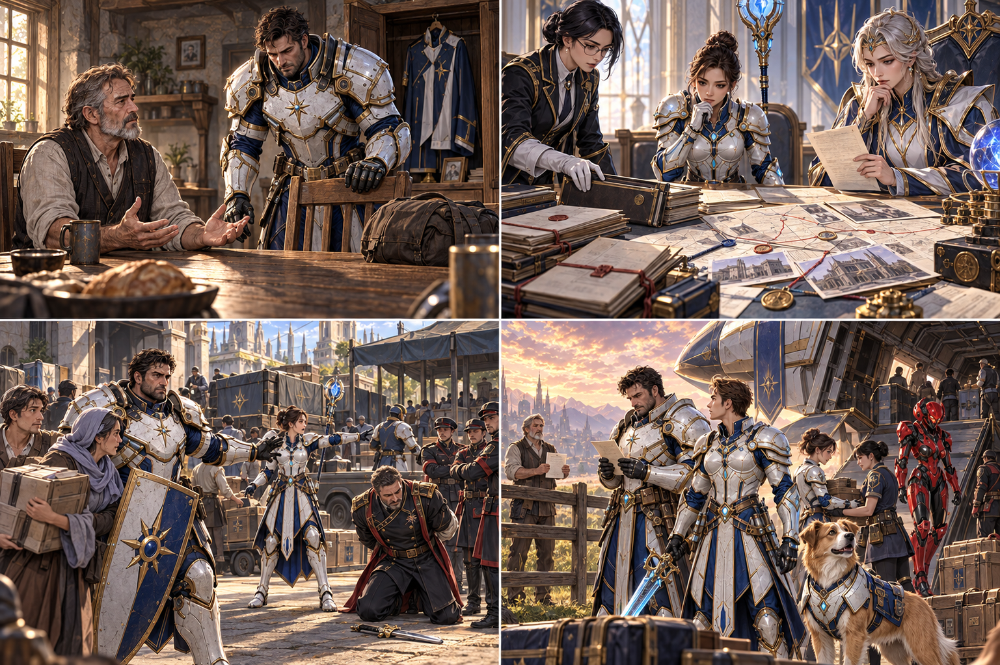

**Establish:** Apply Sin's D10 clarification: prosecution was suppressed to conceal deeper military corruption.

**Growth:** Orin can love without absolving. Mira builds accountability that must continue after she leaves.

**Game beat:** Preserve records and witnesses; protect an authorized relief convoy; hand over the inquiry.

### Panel 1 - C06-S04 - Close / confession

**Picture:** At the same kitchen table, Orin's father speaks with painful sincerity, open empty hands. Orin grips a chair, then begins to sit, setting down his travel pack. A uniform coat hangs in the cupboard. Neither smiles or embraces.

**Caption:** He saved his family and harmed others. Orin stays, without pretending he has forgiven him.

**Father:** I would do it again to keep you alive.
**Father:** But now... I'm not so sure if I did the right thing.

### Panel 2 - C06-S05 - Detail / institutional concealment

**Picture:** Neris investigator lays an unfiled prosecution folder beside diversion ledgers leading to several private military stores. Mira and the queen read the linked evidence. Seals, strings, maps and witness copies, no single conspirator portrait or invented names; records survived deliberate suppression.

**Caption:** Canon D10: a prosecution would have exposed deeper corruption within the military.

**Investigator:** They buried the case to keep the wider corruption out of court.
**Mira:** Put that in the report. It does not make him innocent.

### Panel 3 - C06-S05 - Action / protect the handover

**Picture:** Neris relief depot: Orin shields unarmed record carriers and civilians while Mira coordinates loyal officers protecting loaded supply carts. The marshal is disarmed by authorized guards. Some soldiers refuse the seizure order. No indiscriminate fighting or triumphant mass destruction.

**Caption:** The marshal tries to seize the convoy. Protecting people and evidence comes first.

**Mira:** We have staged relief and a replacement distribution order.

### Panel 4 - C06-S06 - Wide / unfinished repair

**Picture:** At a late-afternoon departure field, Orin holds a reply from his mother and looks toward his father standing at the fence with a signed account. Arin waits beside him, Mira trusts a local coordinator with final loading, Zara and Milo ready by ramp.

**Caption:** His father's testimony enters the inquiry. Reform and reparations remain work for the living.

**Orin:** I said I would write.
**Arin:** Everyone's here.

## Page 10 - A World Worth Keeping

**Chapter 07 | Earth observatory / witness archive / ship**

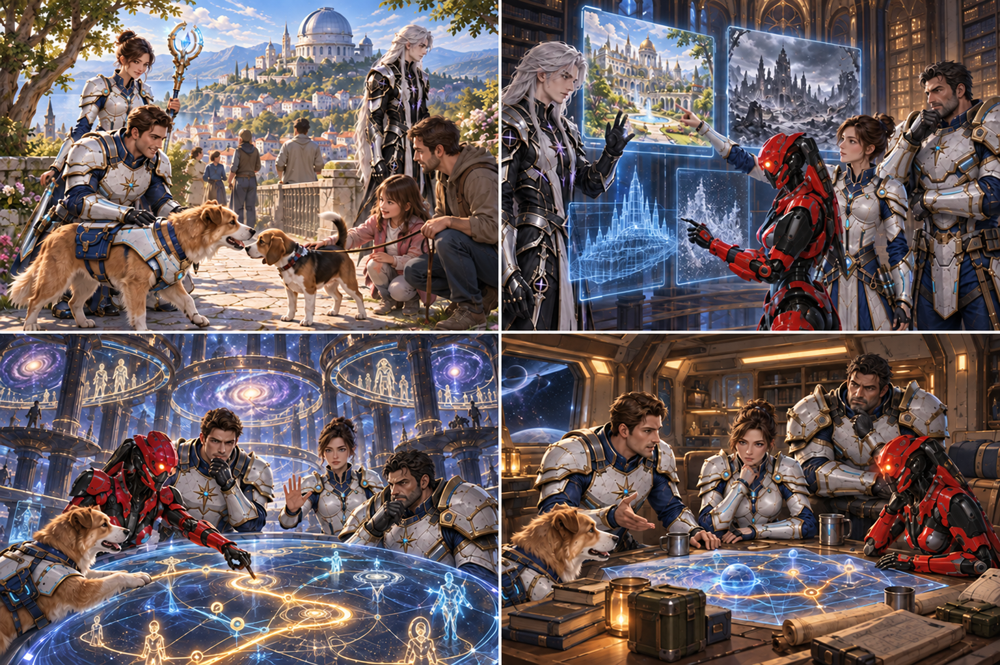

**Establish:** Expand the cosmology without turning made lives into unreal lives or memories into resurrection.

**Growth:** The party chooses this imperfect universe. Kael's scale of judgment is challenged.

**Game beat:** Distinguish records from projections; preserve the archive; recover a safe gateway route.

### Panel 1 - C07-S01 - Medium / ordinary life

**Picture:** On an ordinary Earth observatory hillside town path, armored quadrupedal Milo politely sniffs a smaller unarmored Earth dog beside its human. Arin smiles, Mira nearby; silver-haired Kael looks down toward families in the town. Gentle afternoon light.

**Caption:** Earth matters to Kael. The dogs share ancestry, not a suddenly shared spoken vocabulary.

**Arin:** Can you talk to him?
**Milo:** Not about the observatory.

### Panel 2 - C07-S02 - Medium / evidence challenged

**Picture:** Observatory records chamber: Kael displays miniature histories of an abundant garden city and its later ruins in separate windows; Zara distinguishes a wireframe prediction from a lived record. Mira points to the thriving city, Orin watches a record of an unanswered disaster.

**Caption:** His experiments include real improvements and harm caused by his own choices.

**Kael:** For nine centuries.
**Mira:** Do the nine centuries stop counting?

### Panel 3 - C07-S03 - Wide / the witness archive

**Picture:** Vast nonhuman archive with layered cosmic iteration rings, ancestral migration traces and evolving light patterns. Milo reveals a route from a low viewpoint, Zara translates. Arin listens to a faint fragmentary presence at an interface while Mira signals restraint. No restored parents or ghosts emerging bodily.

**Caption:** Imported ancestry, consciousness shaping reality, traces after death. Evidence of persistence is not a way to restore a whole life.

**Arin:** Can we bring someone back?
**Zara:** Not from this.

### Panel 4 - C07-S04 - Wide / five choices

**Picture:** Warm familiar ship common room: all five companions around a practical gateway map and supply ledger. Arin asks rather than commands. Mira thoughtful and firm, Orin steady, Zara attentive, Milo with paws beside a low route projector.

**Caption:** Stopping Kael requires action at the boundary. Each companion chooses the journey.

**Arin:** Will you come with me?
**Orin:** Yes.

## Page 11 - A Clock to Come Home To

**Chapters 07-08 | Last safe port / physical gateway**

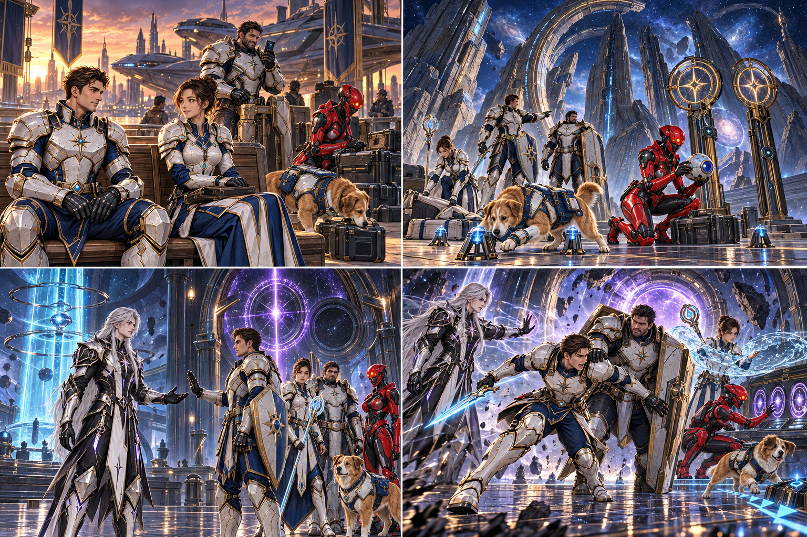

**Establish:** Give the finale emotional stakes and establish the return field before it is needed.

**Growth:** Arin imagines an ordinary future; the party's care becomes careful preparation.

**Game beat:** Pre-finale checkpoint; test elapsed time and spare passenger capacity; target access focuses.

### Panel 1 - C07-S05 - Two-shot / restrained affection

**Picture:** Last safe port at dusk: Arin and Mira sit at opposite ends of a bench with warm space between them. Her relief report is closed, his hands relaxed. In soft background Orin records a family message while Zara and Milo check route equipment.

**Caption:** They make plans small enough to want to survive for.

**Arin:** When we get back, I'd like to see the kingdom in daylight.
**Mira:** I know a street you missed.

### Panel 2 - C08-S01 - Wide / preparation

**Picture:** At immense ancient physical gateway rings under stars, Milo places low navigation nodes using harness tools; Zara retrieves a small unmanned probe near two synchronized clock indicators with no text. Arin Orin secure a route, Mira checks bodies, a folded spare casualty sling ready.

**Caption:** The field carries their measure of elapsed time, all five companions, and one injured passenger.

**Zara:** Nothing stops.
**Milo:** We planned for one.

### Panel 3 - C08-S02 - Wide / last invitation

**Picture:** Gateway control chamber: separate steady cyan sustaining column and bright violet access ring with two channels, one lit. Kael faces Arin and four companions. Kael's hand open in a sincere plea, Arin quiet firm refusal. No weapon impact on the sustaining column.

**Caption:** Rewriting foundations requires a second independent living will's sustained cooperation.

**Kael:** Please.
**Arin:** Not this way.

### Panel 4 - C08-S03 - Action / familiar failure

**Picture:** Arin lunges alone at Kael on reflected gateway floor and is knocked off balance; broad Orin catches his shoulder with shield ready. Mira stabilizes displaced water, Zara studies three access focuses, Milo marks a safe route. Kael remains formidable.

**Caption:** The stance from the dreams fails again. His friends change the outcome.

**Orin:** Not that arrangement.

## Page 12 - Hold

**Chapter 08 / Consequence | Gateway control chamber**

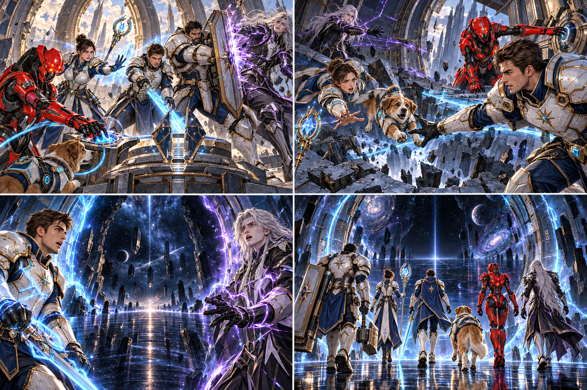

**Establish:** Show a real party victory followed by a causally clear accidental opening.

**Growth:** Arin's protective choice completes access, not consent to Kael's Second Dawn.

**Game beat:** Disable the third access focus; contain the failure; cross together to close it safely.

### Panel 1 - C08-S03 - Action / earned victory

**Picture:** Final of three access focuses extinguishes as Zara releases a contact reached via Milo's blue route, Orin blocks Kael's counterstrike, Mira braces the group and Arin redirects a current at the focus. Kael staggers from the control ring; independent cyan support remains steady.

**Caption:** They force him to stop. Arin has not become stronger than Kael.

**Kael:** All that power. And you spend it refusing me.
**Arin:** It's mine to refuse with.

### Panel 2 - C08-S04 - Action / protective reflex

**Picture:** Gateway floor folds inward beneath Mira and four-legged Milo. Arin extends a shaking hand with a coherent thin cyan field holding the broken floor in place. Zara reaches a slow manual isolation control; Kael's violet channel remains imprinted and live.

**Caption:** His command means Hold. He saves his friends from the boundary failure.

**Zara:** His channel is still live. Don't give it another...

### Panel 3 - C08-S04 - Detail / two authorities

**Picture:** Two distinct cyan and violet living channels light the gateway ring from Arin and Kael. They remain visibly opposed on opposite sides, not shaking hands. A door to an impossibly vast dark reflective realm opens; both men visibly surprised.

**Caption:** Access asks for compatible independent authority. It does not ask for agreement.

**Kael:** Two voices.
**Zara:** It wasn't asking whether you agreed.

### Panel 4 - C08-S04 - Wide / tense passage

**Picture:** Exactly five companions and silver-haired Kael cross a monumental opened portal within a connected blue field: Arin Mira Orin red robot Zara and golden four-legged Milo. A tiny shared clock pulse, vast reflective darkness ahead. Cautious necessary alliance, no celebration.

**Caption:** Their universe is exposed. Safe closure now needs the far side. Retreat cannot undo the opening.

**Mira:** Together. Nobody crosses alone.
**Orin:** That includes you.

## Page 13 - The Origin

**Chapter 09 / Revelation | Outside ordinary spacetime, inside the shared field**

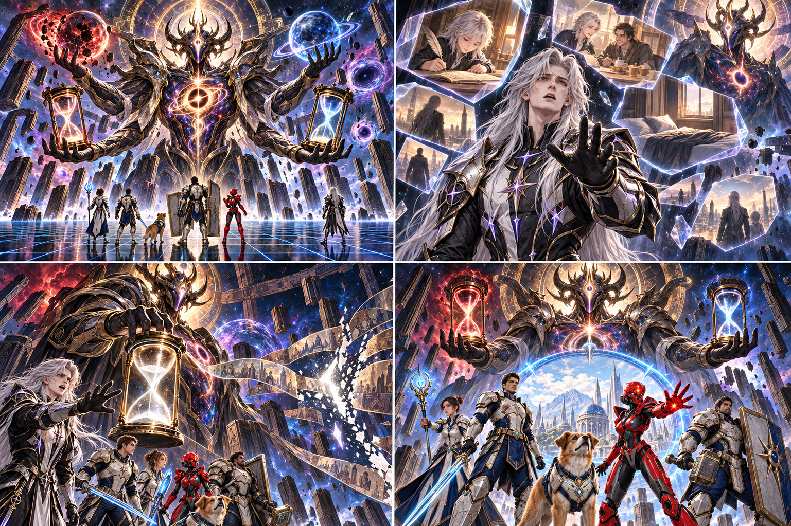

**Establish:** Reveal Aevos, the constructed universe, and Kael's first return as its continuous witness.

**Growth:** Kael recognizes that his despair cannot decide everyone else's worth or future.

**Game beat:** Establish the return anchor; distinguish Aevos's destructive control from sustaining machinery.

### Panel 1 - C09-S01 - Extreme wide / scale

**Picture:** The Origin: gigantic four-armed black gold cosmic armored Aevos with galaxy chest, horned crown, rings, red and blue displayed worlds, two hourglass vessels, shattered floating colonnades, blue grid reflective floor. Exactly five tiny but distinct party members Arin Mira Orin Zara Milo in foreground, silver-haired Kael separate. A steady independent sustaining ring behind Aevos distinct from his chest control tether.

**Caption:** A place someone built. Made lives still feel, choose, and matter.

**Aevos:** A self-sustaining simulation, built to let life develop.
**Zara:** And not the place you came from.

### Panel 2 - C09-S02 - Close / the witness

**Picture:** Kael stands shocked among projections of ordinary moments from many embodied lives: learning to write, shared meals, empty bed. His long silver hair and black armor remain sharply foregrounded. Distant Aevos observes without rage. No reincarnation transfer to Arin.

**Caption:** Earlier renewals preserved Kael's memory. This is his first physical return for assessment.

**Aevos:** The One. The continuous witness.
**Kael:** Those are my lives.

### Panel 3 - C09-S02 - Medium / the fatal inference

**Picture:** Aevos calmly turns an hourglass, a line toward the universe gateway begins to whiten. Kael protests while Arin and companions watch. An old continuity ribbon spanning cosmic cycles is now threatened with total severance, symbolic interface only.

**Caption:** His engineered urge to return helped shape the verdict. This termination would discard Kael too.

**Kael:** Neither does my despair establish that there can be none.
**Aevos:** This universe will end. Another will be made.

### Panel 4 - C09-S03 - Wide / refusal

**Picture:** Exactly five companions stand against the monumental custodian, their blue return anchor behind them showing the small ordinary sky they came from. Mira steps forward, Zara open defiant hand, Orin shields, Milo by route marker, Arin tired and resolute. Reset vessels begin turning despite their refusal.

**Caption:** Aevos hears their choice and continues. He is powerful, not omnipotent.

**Arin:** We do not know the final answer. We still choose to live.
**Aevos:** Your choice is understood.

## Page 14 - Not Another Arin

**Chapter 09 / Turning Point | Origin arena under reset preparation**

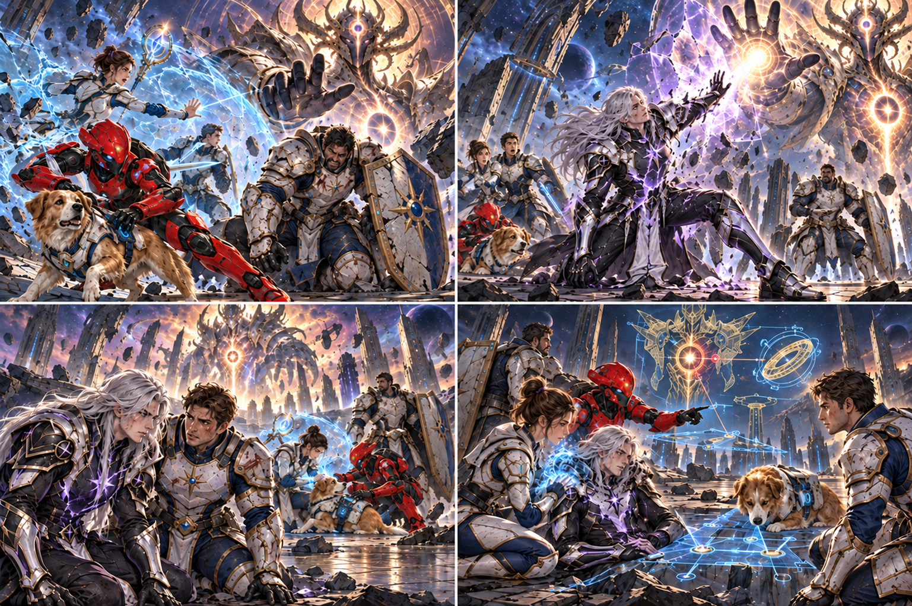

**Establish:** Turn Kael through protection of existing persons, without erasing his responsibility.

**Growth:** Kael abandons replacement as rescue. Arin accepts help without pretending the harm is gone.

**Game beat:** Delay the reset; regroup after Kael intercepts the strike; prepare a bounded counter-command.

### Panel 1 - C09-S03 - Action / outmatched

**Picture:** Origin floor shifts, a blue route marker shattered. Red robot Zara catches fallen golden dog Milo by his supportive harness, never his collar. Orin shields them, injured but standing. Mira reaches through a failing water barrier, Arin's thin protective field buckling under Aevos's raised hand.

**Caption:** They delay the reset. Aevos escalates. The old solo stance cannot save them.

**Mira:** Arin - back to my voice.

### Panel 2 - C09-S04 - Action / interception

**Picture:** Silver-haired Kael suddenly steps between Aevos's brilliant strike and Arin's party. His protective field cracks and he falls to one knee, armor fractured with violet light escaping, visibly seriously hurt but no graphic gore. The five companions survive behind him.

**Caption:** His first allied act is protection. It costs him what he cannot promise to recover.

**Kael:** I thought that if I preserved the possibility of life, I had preserved the lives themselves.
**Kael:** I was wrong.

### Panel 3 - C09-S04 - Close / this person

**Picture:** Wounded Kael kneels beside young Arin, looking past him to Mira helping Zara and Milo while Orin guards. Colossal Aevos distant. Kael's expression fierce with recognition, Arin upset, no forgiveness embrace.

**Caption:** A comparable bearer of power would not be this person, or these companions.

**Kael:** His name is Arin.
**Arin:** You were going to do this to us.
**Kael:** I know.

### Panel 4 - C09-S05 - Medium / the plan

**Picture:** Mira kneels to stabilize wounded Kael with restrained water arts while Arin listens opposite. Zara points out the destructive chest control tether and separate sustaining ring, Milo maps low contacts and Orin braces the route. Team work, Kael unable to stand.

**Caption:** Two compatible speakers can hold continuity briefly while the five companions isolate destructive access.

**Arin:** Not a new universe.
**Kael:** This one. Keep what is here.

## Page 15 - Five Voices, Two Speakers

**Chapter 09 / Resolution | Origin's supervisory contacts and reflective arena**

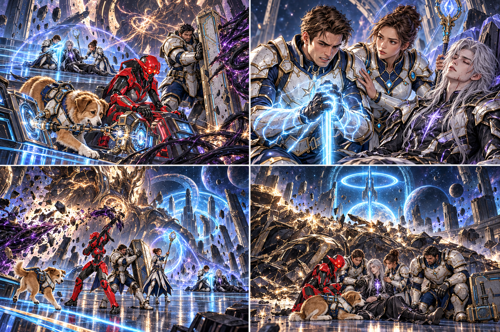

**Establish:** Pay off every companion's skill and distinguish defeating the custodian from destroying life support.

**Growth:** Arin plans to live and obeys the stop signal. Victory belongs to the party.

**Game beat:** Hold, route, isolate, release: coordinated objectives create a final local victory window.

### Panel 1 - C09-S05 - Action / the moving route

**Picture:** Four-legged Milo uses a harness-mounted tool in a low contact while red robot Zara isolates a nearby supervisory console. Broad Orin plants his shield and holds a failing connection apart on the moving reflected blue route. Arin and seated wounded Kael sustain a thin field in distance, Mira beside them.

**Caption:** Milo finds the route. Zara identifies the address. Orin keeps the crossing open.

**Milo:** Left marker. Follow the blue reflection, not the wall.
**Orin:** I've got the crossing. Go!

### Panel 2 - C09-S05 - Close / restraint

**Picture:** Close on Arin shaking with effort holding a narrow cyan counter-Axiom beside wounded seated Kael's violet signature. Mira catches Arin's attention with calm urgent eye contact and a hand near him. His blaze visibly reduces to controlled light instead of exploding into new armor.

**Caption:** More force would destroy him. He listens and reduces it.

**Mira:** Arin. Back to my voice.
**Arin:** I'm here.

### Panel 3 - C09-S05 - Action / now

**Picture:** Milo safely backs out across blue return mark, Zara deliberately disconnects a bright destructive tether, Orin prevents contact rejoining, Mira diverts the discharge, Arin and wounded Kael keep a thin field steady. Colossal Aevos's chest tether breaks away from machinery; vast separate sustaining ring intact. All five identifiable.

**Caption:** Milo clears the contact. Isolation opens a final window against Aevos's local presence.

**Milo:** Clear.
**Zara:** Now.

### Panel 4 - C09-S05 - Wide / one more pulse

**Picture:** Defeated Aevos's embodied black gold cosmic armor collapses into inert shards and fading light after the party's final assault. His displayed worlds dim like projections. Behind him the independent cyan sustaining structure visibly continues two luminous concentric pulses; the real universe remains visible in the intact small gateway. Five exhausted companions immediately turn to wounded Kael, no victory pose.

**Caption:** Aevos dies in this staged ending. The independent sustaining system continues.

**Mira:** It's still running.
**Milo:** Home is still there.

## Page 16 - The Lives They Kept

**Epilogue | Return passage, Neris, Veyra and a shared table**

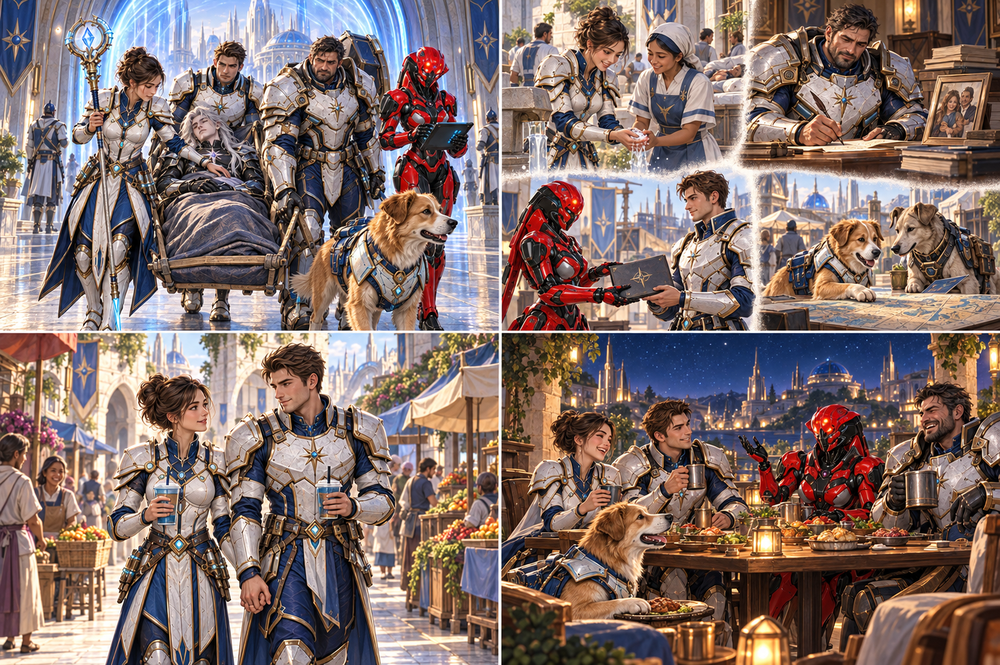

**Establish:** End with preserved lives and ongoing repair, not instant cures or a new apocalypse.

**Growth:** Arin inherits knowledge and chooses company. Kael's eventual survival remains unknown.

**Game beat:** Evacuate Kael; close destructive access safely; ordinary visits and a walk without a contract.

### Panel 1 - E01-S01 - Wide / carry him home

**Picture:** The five companions escort critically wounded silver-haired Kael in a prepared casualty sling through the gateway inside the blue synchronized field. Orin carries support, Mira treats, Zara preserves records, Milo guides the return mark, Arin keeps close. No glowing power transfer, clocks continue forward.

**Caption:** Knowledge is preserved. No immortality, reincarnation, or inherited office is promised.

**Kael:** Do not call it truth merely because I said it.
**Mira:** He is alive. I can't tell you more than that yet.

### Panel 2 - E01-S02 - Montage / work continues

**Picture:** Four soft-edged connected epilogue vignettes within this single panel: Mira helps a Neris clinic coordinator at clean running water; Orin writes a family letter beside testimony folders; red robot Zara hands Arin a new contract; golden dog Milo reunites with his canine route partner at a low Veyra map. Everyday labor and warmth, no coronation.

**Caption:** Relief, testimony, letters, contracts, reunion. The sky surviving did not finish the work.

**Milo:** I found the way back too.

### Panel 3 - E01-S03 - Two-shot / daylight

**Picture:** Arin and Mira walk a modest sunlit Neris market street, carrying two inexpensive drinks. White navy gold armor travel-worn, shoulder and hands relaxed; fingertips briefly touch at a cup. Repaired roofs and ordinary vendors behind. Gentle affection, no kiss or wedding.

**Caption:** He spends a little on something he wants. They imagine another ordinary day.

**Arin:** Could we do this again?
**Mira:** Yes.

### Panel 4 - E01-S03 - Wide / room for him

**Picture:** Warm evening meal on a modest Neris street terrace. Exactly five companions: Arin sits in the last open chair, Mira beside him, older broad Orin across, red robotic Zara telling a story, golden quadrupedal Milo at a low accessible place by the table with his own plate. Starry sky over repaired city; cozy candid conversation, no extra hero.

**Caption:** He counts the places. There is room for him. He sits.

**Zara:** Arin, are you listening?
**Arin:** Yes.

## Page 17 - The Small Things We Keep

**Optional Party Scenes / A | Quiet pauses between required scenes**

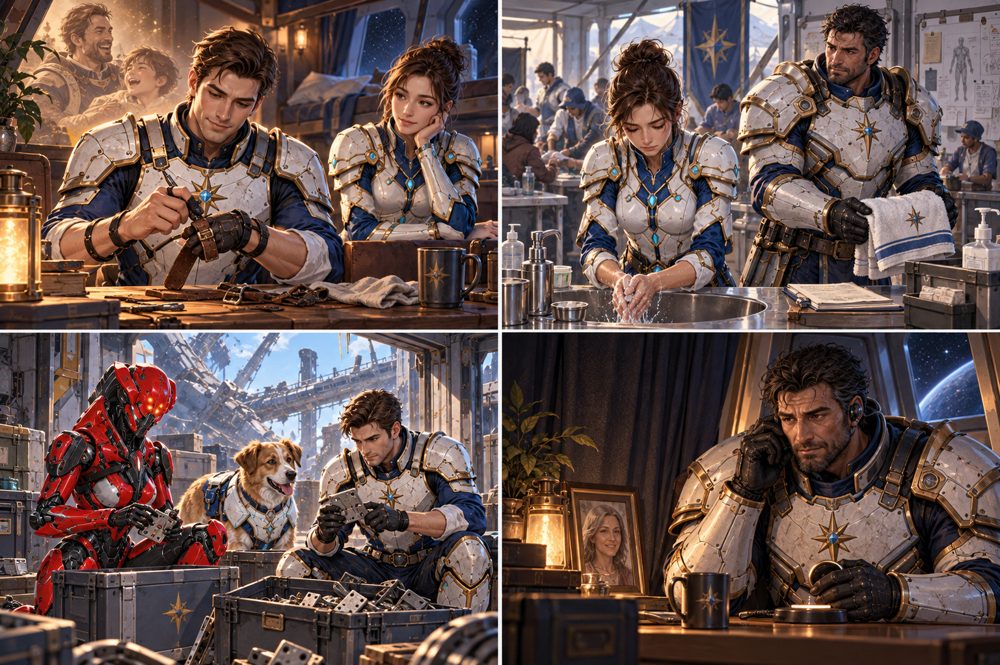

**Establish:** Give grief, healing limits and unglamorous care room beside the cosmic plot.

**Growth:** Attachment grows through remembered laughter, practical requests and work without applause.

**Game beat:** Optional conversations; no romance, morality, or final-battle eligibility rewards.

### Panel 1 - OPT-01 - Close / memory beyond loss

**Picture:** In warm ship lamplight, Arin repairs his old wrist strap and smiles unexpectedly, Mira quietly sitting nearby. A faint benign memory reflection of his father laughing, no explosion or ghost. Intimate but platonic posture.

**Caption:** After C04-S02. His parents were people, not only the event that hurt him.

**Arin:** He'd explain the ending before he remembered the beginning.
**Mira:** You remembered this part today.

### Panel 2 - OPT-02 - Medium / a concrete need

**Picture:** During Neris relief work, exhausted Mira washes her hands at clinic basin after a limited treatment. Orin sets a clean towel and supply list beside her without lecturing. A busy treatment board behind, no dying body shown.

**Caption:** During C06-S05. Being skilled does not make a healer limitless.

**Mira:** Another trained healer. Clean supplies. Time.
**Orin:** Which of those can we get first?

### Panel 3 - OPT-03 - Medium / staying afterward

**Picture:** At a damaged station doorway after the apology, red robotic Zara sorts a box of hinges and reusable parts. Arin sits down to sort the other half. Modest repair work, ordinary daylight, no dramatic glowing effects.

**Caption:** After C05-S04 and another shared task. Zara chooses the aftermath as part of adventure.

**Arin:** This is a box of hinges.
**Zara:** The door won't open without them.

### Panel 4 - OPT-04 - Close / more than one feeling

**Picture:** Orin alone in a safe ship communications nook listening carefully to his mother's audio message, then recording a reply. Gloved hands relaxed, soft lamp on his weathered face, closed privacy curtain, no mother's location or screen text.

**Caption:** After C06-S06. Love and anger can coexist; neither speaks for the victims.

**Mother:** Being angry has never told me that I stopped loving him.
**Orin:** I just wanted to hear from you.

## Page 18 - Learning the Way Back

**Optional Party Scenes / B | Before the gateway / after a later fight**

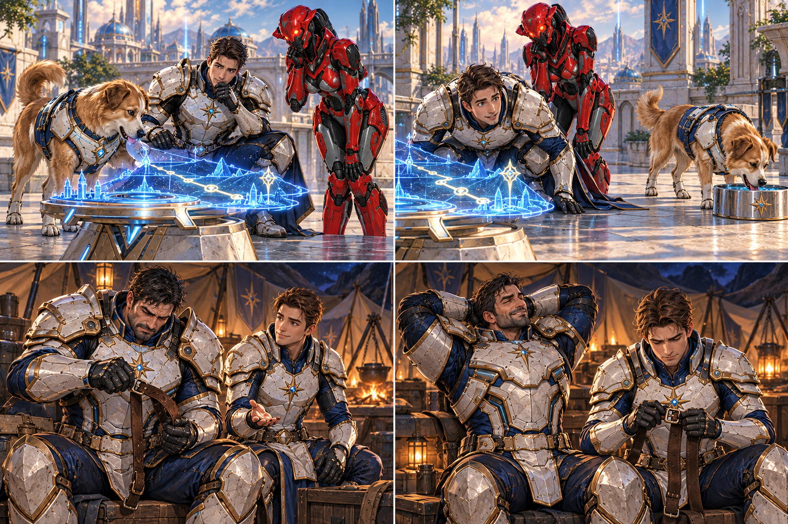

**Establish:** Pay attention to Milo's own way of seeing and make care reciprocal for Orin.

**Growth:** Arin changes his viewpoint and offers help without treating anyone as helpless.

**Game beat:** Short optional map and equipment interactions; no new powers or compulsory side quests.

### Panel 1 - OPT-05 - Medium / another viewpoint

**Picture:** Golden quadrupedal Milo stands by a low spatial route projector adjusted with his nose; the luminous map shifts with the viewing angle. Arin crouches awkwardly and red robot Zara watches with amusement. Paw-width lanes clearly shown.

**Caption:** Before C08-S01. Kynari maps record approach, position and the route back.

**Arin:** The map moved.
**Milo:** You moved.

### Panel 2 - OPT-05 - Wide / gentle joke

**Picture:** Arin carefully holds an awkward crouch at Milo's intended low viewing angle while Milo pads away on four paws toward a drinking bowl, Zara amused nearby. Route now visibly lines up correctly from Arin's new position.

**Caption:** The unfamiliar map becomes legible when he stops assuming his viewpoint is the default.

**Milo:** Good. Hold that for a moment. I need a drink.

### Panel 3 - OPT-06 - Close / offered back

**Picture:** After a fight at a quiet camp, older broad Orin struggles one-handed with a strap buckle. Younger Arin sits beside him and patiently holds out his empty open hand to offer help. Matching white navy gold armor, different builds. No new injury drama.

**Caption:** After C06-S06. The man who always returns can also accept a hand.

**Orin:** I can manage.
**Arin:** I know.

### Panel 4 - OPT-06 - Medium / accepted care

**Picture:** Orin has handed the strap to Arin, who concentrates on untwisting the buckle. Orin relaxes and looks away instead of inspecting. Warm modest camp light, quiet humor between distinct older and younger armored men.

**Caption:** The bandage from the evacuation transport has become a two-way promise.

**Orin:** Then this should be excellent work.
**Arin:** Try not to inspect it while I'm doing it.

## Scene coverage index

| Scene | Storyboard page.panel |
| --- | --- |
| C00-S01 | 01.1, 01.2 |
| C00-S02 | 01.3 |
| C00-S03 | 01.4 |
| C01-S01 | 02.1 |
| C01-S02 | 02.2 |
| C01-S03 | 02.3 |
| C01-S04 | 02.4 |
| C02-S01 | 03.1 |
| C02-S02 | 03.2 |
| C02-S03 | 03.3 |
| C02-S04 | 03.4 |
| C03-S01 | 04.1 |
| C03-S02 | 04.2 |
| C03-S03 | 04.3 |
| C03-S04 | 04.4 |
| C04-S01 | 05.1 |
| C04-S02 | 05.2 |
| C04-S03 | 05.3 |
| C04-S04 | 05.4 |
| C05-S01 | 06.1 |
| C05-S02 | 06.2 |
| C05-S03 | 06.3 |
| C05-S04 | 06.4 |
| C05-S05 | 07.1, 07.2, 07.3, 07.4 |
| C06-S01 | 08.1 |
| C06-S02 | 08.2 |
| C06-S03 | 08.3 |
| C06-S04 | 08.4, 09.1 |
| C06-S05 | 09.2, 09.3 |
| C06-S06 | 09.4 |
| C07-S01 | 10.1 |
| C07-S02 | 10.2 |
| C07-S03 | 10.3 |
| C07-S04 | 10.4 |
| C07-S05 | 11.1 |
| C08-S01 | 11.2 |
| C08-S02 | 11.3 |
| C08-S03 | 11.4, 12.1 |
| C08-S04 | 12.2, 12.3, 12.4 |
| C09-S01 | 13.1 |
| C09-S02 | 13.2, 13.3 |
| C09-S03 | 13.4, 14.1 |
| C09-S04 | 14.2, 14.3 |
| C09-S05 | 14.4, 15.1, 15.2, 15.3, 15.4 |
| E01-S01 | 16.1 |
| E01-S02 | 16.2 |
| E01-S03 | 16.3, 16.4 |
| OPT-01 | 17.1 |
| OPT-02 | 17.2 |
| OPT-03 | 17.3 |
| OPT-04 | 17.4 |
| OPT-05 | 18.1, 18.2 |
| OPT-06 | 18.3, 18.4 |

## Visual status

New illustrations use the built-in image-generation tool and the provided/reference character designs. Environment designs and scene blocking are proposed visualization. Minor appearance and costume variation is expected in this draft; the canonical character assets are not changed. The HTML website displays quadrants of the same art sheets with separate, selectable dialogue beneath every panel.
